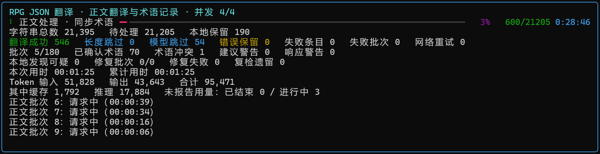
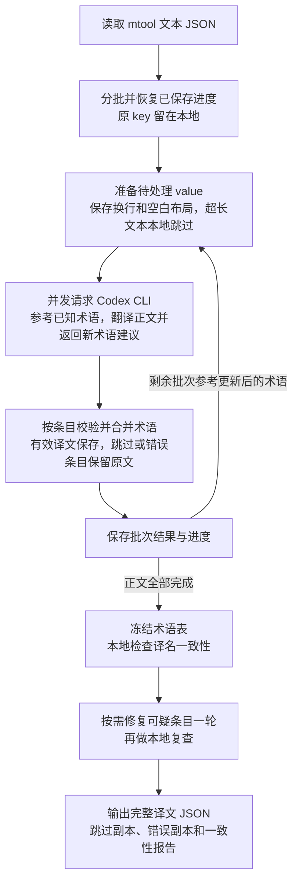

# codex-mtool-translate

使用本地 Codex CLI，把 **mtool 导出的 RPG 游戏文本 JSON 翻译为简体中文**。

**只翻译字符串 value，key、结构、顺序和非字符串值保持原样，输出新文件，不覆盖原文。** 例如：`{"古びた剣":"古びた剣"}` → `{"古びた剣":"陈旧的剑"}`。支持嵌套对象和数组，会处理所有字符串 value。

## 界面与功能

- **分批与并发：**默认每批最多 120 条、约 12,000 个序列化字符，最多 4 批并发；请求不发送原始 key，减少重复输入。
- **术语统一：**边翻译边收集专名，供后续批次参考；正文结束后检查一致性并修复一轮。
- **格式保护：**本地保留换行、空白行及行首尾空白，模型按原行号返回非空白行译文；校验占位符、标签和游戏控制码。
- **跳过与容错：**超长文本本地保留，模型可跳过字符画等特殊内容；请求错误有限重试，失败条目保留原文。
- **进度与续跑：**显示条目、批次、时间、token、跳过和失败统计，保存断点并生成独立检查副本。



上图为正文翻译中的界面示例，下方显示正在请求的批次。后续检查和修复阶段会显示相应进度条；图中数量、耗时仅属于该次任务。

| 界面区域 | 如何理解 |
| --- | --- |
| 阶段与并发 | 显示当前阶段、正在处理的批次数和并发上限；正文翻译 → 本地一致性检查 → 修复可疑条目 → 本地复检 |
| 进度与条目 | 显示处理数量和总数，区分翻译成功、本地保留、长度跳过、模型跳过和错误保留；所有条目仍写入完整译文 |
| 失败与警告 | 失败批次可包含已保存的有效译文；术语冲突、建议警告和响应警告本身不计作翻译失败 |
| 可疑项与修复 | “本地发现可疑”是候选数量，“复检遗留”是修复后仍需人工确认的数量，不等同于确定错误 |
| 用时与 token | 同时显示本次运行和断点累计用时；输入、输出及其缓存/推理明细只统计 CLI 已报告的用量 |

进度 100% 表示对应阶段已处理完。完成后优先查看错误副本，再检查跳过副本和 `consistency.json` 中的遗留可疑项。

## 快速开始

### 安装与登录

需要 **Windows、Python 3.11 或更新版本、可用且已登录的 Codex CLI**。下载本仓库，保留 `translate.py`、`translate-json.bat`、`requirements.txt` 在同一目录，并在该目录打开 PowerShell：

```powershell
python -m pip install -r requirements.txt
codex login
codex login status
```

BAT 会检查并尝试安装 Rich；`python` 也可换成 `py -3`。

没有 CLI 时，可通过 Node.js/npm 执行 `npm install -g @openai/codex`，或参考 [官方安装说明](https://github.com/openai/codex#installing-and-running-codex-cli)。程序复用 CLI 的认证和提供方配置，用量及计费遵循所选账号，详见 [认证说明](https://learn.chatgpt.com/docs/auth)。

也可使用 App 附带的 CLI，常见路径为 `%LOCALAPPDATA%\OpenAI\Codex\bin\<版本目录>\codex.exe`。程序从 PATH 查找，**不会自动扫描 App 目录**；找不到时指定：

```powershell
python .\translate.py "D:\GameText\target.json" --codex "C:\实际安装目录\codex.exe"
```

路径可能随 App 更新改变。CLI 有有效登录状态即可运行，无需保持 App 打开。

### 开始翻译

1. 用 mtool 导出文本 JSON。
2. 把**一个** `.json` 文件拖到 `translate-json.bat`，或执行：

   ```powershell
   python .\translate.py "D:\GameText\target.json"
   ```

3. 等待翻译、术语检查和修复结束，检查输出及报告。
4. 按所用 mtool 版本的译文导入方式使用主输出，并在游戏中抽查显示效果。

## 处理流程



无需预先扫描全文。每批发送短 ID、value 的非空白行（`index`、`text`）和相关术语；空白行不请求模型，原行号从 0 开始且可不连续。返回后本地按行号恢复格式，缺失、重复或新增行号按条目报错。更新后的术语用于后续请求；并发中已发出的批次可能使用旧快照。

预设术语优先，否则采用最先成功保存的译名。不同建议只记录冲突，不导致失败。正文结束后冻结术语表，检查成功译文是否含统一译名，对可疑条目修复一轮并复查。

### 跳过和错误保留

| 情况 | 处理方式 |
| --- | --- |
| 空白、纯数字字符串 | 本地直接保留 |
| value 超过 3,000 字符 | 本地跳过，不发送模型；按解码后的字符数计算 |
| 模型判断为字符画、文字地图等不应翻译内容 | 跳过并保留原文，记录原因 |
| 某条 ID 缺失、重复，或译文行号/受保护格式不符 | 只保留对应条目原文，同批有效结果继续保存 |
| 返回陌生或无效 ID | 忽略该返回行并记录响应警告，不按位置猜测对应关系 |
| 请求失败或返回整体无法解析 | 该次请求涉及的条目保留原文 |
| 最后术语修复失败 | 保留此前有效译文，记录修复错误 |

**“错误保留”是正文翻译失败后保留原文的条目数；“跳过”是主动决定不翻译，不计作错误。两者都仍在完整输出中，不删除 key/value。** 跳过和正文失败条目不参加最后的术语修复；修复中判定应跳过的条目恢复原文。

网络连接、DNS、TLS 和超时等错误默认最多尝试 3 次，包含首次。认证、权限、额度、限流和模型参数错误不按单纯网络问题重试。批次失败不终止后续处理；输入无效、断点不匹配或文件写入等任务级错误会停止程序。

## 模型与术语设置

修改 `translate.py` 顶部配置，正文和修复共用：

```python
MODEL = "gpt-5.6-luna"
EFFORT = "high"
```

使用当前账号和提供方支持的模型 ID、推理强度；当前没有 `--model`、`--effort` 参数。同一区域的 `STYLE` 控制翻译风格，默认为简体中文 RPG 本地化。

预设术语可保存为 UTF-8 JSON，再通过 `--glossary` 指定：

```json
{"Aelric":"艾尔里克","Silverwood":"银木森林"}
```

需要别名时也支持 `{"terms":[{"source":"Aelric","target":"艾尔里克","aliases":["Sir Aelric"]}]}`。

```powershell
python .\translate.py "D:\GameText\target.json" --glossary ".\glossary-seed.json"
```

自动生成的 `glossary.json` 是快照，手改不会覆盖任务规则。**更改原文、模型、推理强度、风格、预设术语或分批设置，需要新任务目录。**

## 进度与断点续跑

进度显示见上方界面示例。Token 总量为输入与输出之和；缓存是输入的一部分，推理是输出的一部分，不重复相加。未报告用量的请求单独计数。

按 **Ctrl+C** 暂停并等待退出，再拖入同一原文或执行同一命令即可续跑。已保存的成功、跳过和失败结果直接复用，未保存请求可能重做；**续跑不会自动重试已保存的失败条目**。

续跑需保持任务配置、行号和逐条 ID 校验协议一致；旧协议断点不能用于当前版本，请用新的 `--work-dir` 和输出路径。并发、超时、重试和显示设置可以调整；同一任务目录只允许一个翻译进程。另开终端只查看状态，不调用模型：

```powershell
python .\translate.py "D:\GameText\target.json" --status
```

自定义了 `--work-dir` 时，查看状态也要传同一目录。从头重跑或采用新配置时，指定新的任务目录和输出：

```powershell
python .\translate.py "D:\GameText\target.json" --work-dir "D:\GameText\work\run-2" --output "D:\GameText\target.rerun.zh-CN.json"
```

## 输出与日志

默认在**原文目录**生成：

| 文件/目录 | 用途 |
| --- | --- |
| `target.zh-CN.json` | 完整译文，供 mtool 使用 |
| `target.zh-CN.skipped.json` | 跳过检查副本，包含原文和原因 |
| `target.zh-CN.errors.json` | 错误检查副本，包含原文、原因、模型返回和当前保留文本 |
| `work/target.json.translation-live/` | 日志及断点目录 |

主输出和两份检查副本在任务完成时写出。检查副本是带 `count`、`entries` 的报告，**不能作为 mtool 译文导入**。`--output` 改变三个输出文件的位置，`--work-dir` 独立改变日志目录。所有输出采用 UTF-8 无 BOM。

错误副本中的 `model_response` 保存按 ID 唯一对应的模型返回条目，即使译文未通过校验；新请求的 `lines` 中每行包含原行号 `index` 和译文 `text`。`current_text` 是最终保留内容。未收到、无法解析或无法唯一关联时，`model_response` 为 `null`，并附 `model_response_note`。

任务目录中的记录按阶段生成：

| 文件 | 说明 |
| --- | --- |
| `manifest.json` | 任务配置及身份，检查能否续跑 |
| `monitor.json` | 当前进度、状态、累计时间与用量 |
| `batches.jsonl`、`repairs.jsonl` | 正文/修复结果及断点依据，保留模型返回行；`response_warnings` 记录陌生/无效 ID，正文还包含术语建议和冲突 |
| `requests.jsonl` | 请求状态、尝试次数、时间和 token 用量 |
| `failures.jsonl` | 错误阶段、批次、原因、返回信息及受影响原文 |
| `glossary.json` | 统一术语及别名快照 |
| `consistency.json` | 一致性检查、修复和遗留可疑项 |

运行中可查看最近失败：

```powershell
Get-Content -LiteralPath "D:\GameText\work\target.json.translation-live\failures.jsonl" -Encoding UTF8 -Tail 5
```

JSONL 每行一条记录，行数不等于批次数；无失败时文件可能不存在或为空。运行中勿删改断点，`run.lock` 存在不代表进程仍在运行。

## 手动修正译文（可选）

翻译完成后，发现错译、漏译或不满意的译名，可使用 `merge-translations.py` 将手动修正的条目合并到完整译文。它是可选的本地工具，不调用模型；使用时与 `translate.py` 放在同一目录。

先创建 UTF-8 无 BOM 的 `corrections.json`，只放需要替换的条目，保持完整译文中已有的 key 不变，value 填写修正后的译文。例如：

```json
{"古びた剣":"陈旧的剑"}
```

也可使用局部重新翻译后的键值对文件。然后在项目目录执行：

```powershell
python .\merge-translations.py "D:\GameText\target.zh-CN.json" "D:\GameText\corrections.json"
```

第一个参数是要更新的完整译文，第二个是修正文件。脚本按 key 替换对应 value，其余条目保持原样；有实际修改时，先生成 `.before-merge-时间.bak` 完整备份，再写入目标文件。仅支持平面的字符串键值对象；修正文件出现不存在的 key 时停止合并，不写入目标。

修正只更新译文，不更新断点、跳过/错误副本或一致性报告。再次运行原任务时，若输出已被手动修改，程序会提示与断点结果不符；加 `--overwrite` 会重新生成断点中的译文并覆盖手动修正。

## 常用参数

完整说明可运行 `python .\translate.py --help`。

| 参数 | 默认值/用途 |
| --- | --- |
| `--workers` | `4`，并发批次上限；遇到限流或网络不稳可降低 |
| `--batch-items`、`--batch-chars` | `120` 条、`12000` 个序列化字符；字符预算不是 token 上限 |
| `--output` | 指定完整译文路径 |
| `--work-dir` | 指定日志与断点目录 |
| `--glossary` | 预设术语文件 |
| `--codex` | 指定 CLI 路径 |
| `--timeout`、`--attempts` | `600` 秒、`3` 次；尝试次数包含首次 |
| `--plain` | 使用普通文本进度 |
| `--status` | 只查看状态 |

## 使用注意

- **完成不代表全部翻译成功。** 查看跳过、错误保留和遗留可疑项统计及对应报告。
- 一致性检查不评判首次译名质量，也不自动区分同名人物；漏提术语、代词或省略可能导致漏报或误报。
- 字符画识别和控制码保护可能遗漏，建议先用小文件在游戏中验证。
- value 和术语会发送给模型服务，日志包含原文。发布时排除游戏 JSON、译文、`.bak` 备份和 `work/`，反馈问题使用脱敏记录。